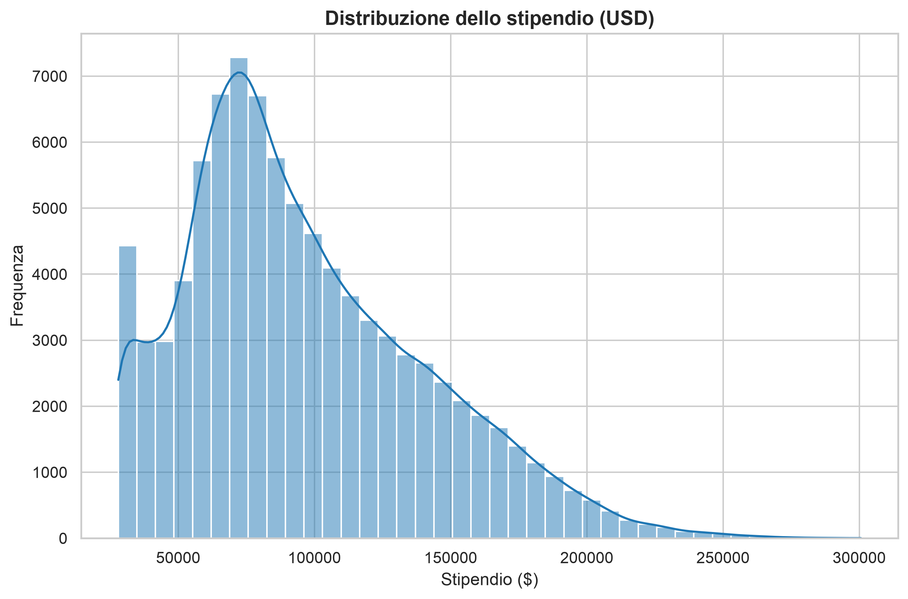
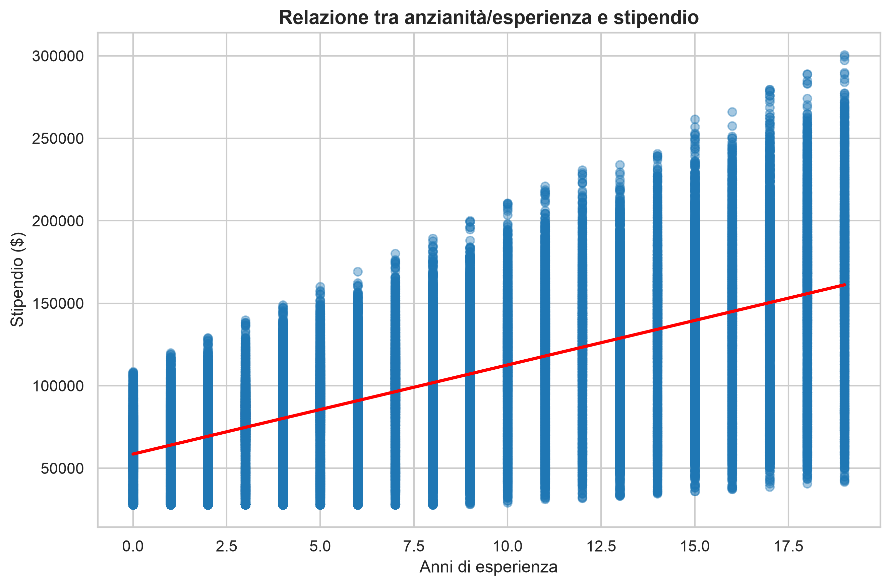
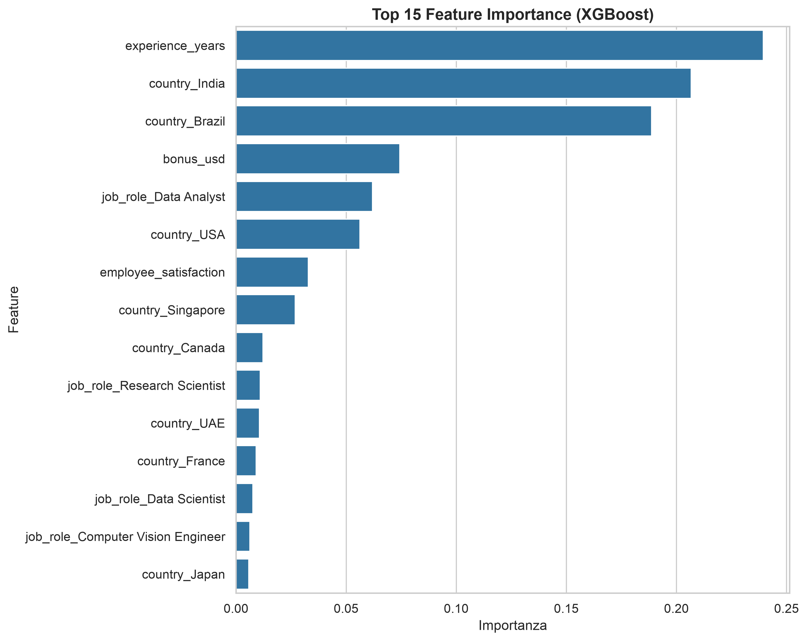
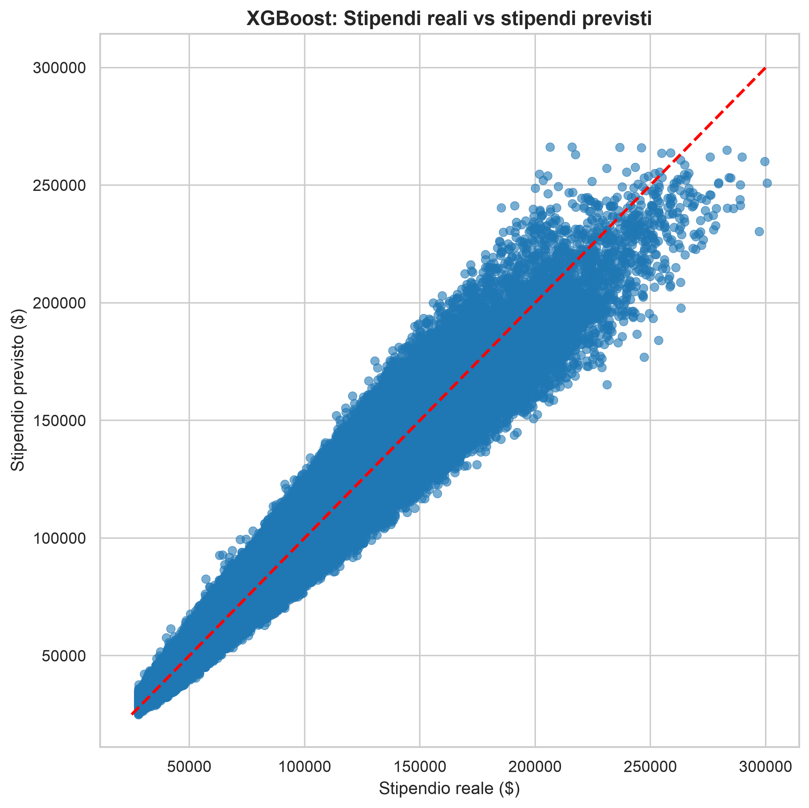

# Global AI & Data Jobs — Salary Prediction

This project trains and evaluates regression models to predict salary (`salary_usd`) for AI and Data roles around the world, using the public Kaggle dataset:

[`mohankrishnathalla/global-ai-and-data-jobs-salary-dataset`](https://www.kaggle.com/datasets/mohankrishnathalla/global-ai-and-data-jobs-salary-dataset)

## About the dataset

The dataset is a large global collection of tech job records from 2020 to 2026, covering roles in Artificial Intelligence, Data Science, Machine Learning, Software Engineering and Analytics.

It includes job-level attributes such as role category, country, company size, experience level, work setup (remote, hybrid, onsite), salary in USD, required skills, and workplace indicators like promotion speed, job security and work-life balance.

> **Note:** this is a **synthetic (artificially generated) dataset**, not real-world collected data. It's a good fit for practicing data cleaning, feature engineering and regression modeling, but the results shouldn't be read as a picture of actual labor market salaries.

Two models are compared:

- **Random Forest Regressor**
- **XGBoost Regressor**

Both are evaluated with **5-fold cross-validation**, using **MAE** (Mean Absolute Error) and **R²** as metrics.

## Requirements

- Python 3.9+
- Required packages:

  ```bash
  pip install kagglehub pandas numpy matplotlib seaborn scikit-learn xgboost
  ```

- A configured Kaggle account for `kagglehub` (needed to download the dataset). See the [official documentation](https://github.com/Kaggle/kagglehub).

## Project structure

```
salary_prediction.py    # main script
output_plots/            # auto-generated folder
├── salary_distribution.png
├── experience_vs_salary.png
├── feature_importance.png
└── real_vs_predicted.png
README.md
```

## How to run

```bash
python salary_prediction.py
```

Here's what the script actually does:

1. **Downloads** the dataset from Kaggle (via `kagglehub`)
2. **Explores the data (EDA)**: prints the dataset shape, `df.info()`, descriptive statistics for both numeric and categorical columns, and checks for missing values and duplicate rows
3. **Cleans the data**: drops rows with missing values and duplicate rows
4. **Visualizes the data**:
   - overall salary distribution
   - relationship between seniority/experience and salary (it auto-detects whether the experience column is numeric, i.e. years of experience, or categorical, e.g. Entry/Mid/Senior/Executive, and picks a regression plot or a boxplot accordingly)
5. **Encodes categorical variables** with one-hot encoding
6. **Trains and evaluates** Random Forest and XGBoost with 5-fold cross-validation
7. **Checks feature importance**: prints the top 15 features according to XGBoost, and flags a warning if a single feature accounts for more than 50% of total importance (a possible sign of data leakage)
8. **Generates and saves** all plots to `output_plots/`

## Generated plots

| File | Description |
|------|--------------|
| `salary_distribution.png` | Histogram (with KDE) of the overall salary distribution |
| `experience_vs_salary.png` | Salary vs. seniority/years of experience: a scatter plot with regression line for numeric experience, or a boxplot ordered by median salary for categorical experience level |
| `feature_importance.png` | Top 15 most important features according to the trained XGBoost model |
| `real_vs_predicted.png` | Actual vs. predicted salary from cross-validated XGBoost predictions |

## Results (example run)

| Model         | MAE                  | R²     |
|---------------|----------------------|--------|
| Random Forest | $8,595.06 ± $66.75   | 0.9340 |
| XGBoost       | $8,278.88 ± $37.95   | 0.9399 |

> **Note:** values may vary slightly depending on the dataset version downloaded and the execution environment.

## Analysis and results

### 1. Data distribution and relationships



### 2. Model performance



## Possible future improvements

- Hyperparameter tuning (e.g. `RandomizedSearchCV`, Optuna)
- More sophisticated handling of high-cardinality categorical variables (e.g. target encoding)
- A dedicated holdout split for final model validation
- Model interpretability with SHAP

## License

This project is shared for educational and demonstration purposes. The original dataset follows the usage terms set by its author on Kaggle and, as noted above, is synthetic in nature.
